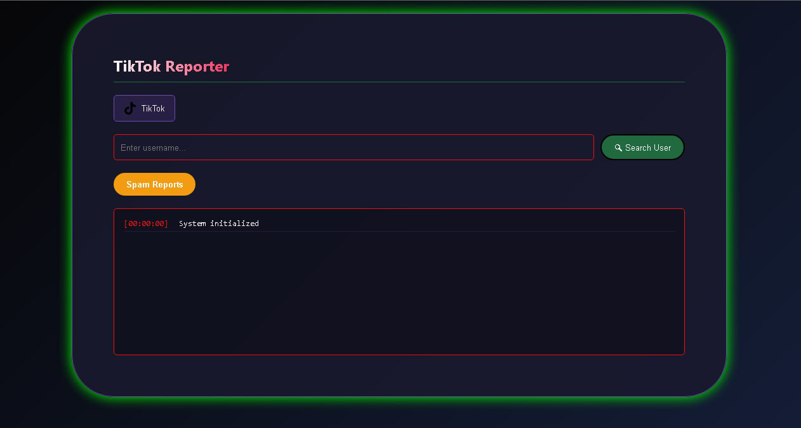

  

<h1 align="center">TikTok Report Tool</h1>

  A web-based platform designed to simplify the process of submitting reports for TikTok accounts that may not follow community guidelines.  
  Users can easily provide a username, and the system handles the rest.

---

### ⚙️ How It Works

- The platform is simple to use - you only need the TikTok username of the target profile.  
- All accounts generated via bulk systems are automatically integrated into the platform.  
- The system uses a large number of pre-created accounts from automated generation software to improve coverage and efficiency.

---

### 🟢 Get the Tool

  

---

### 📜 Legal Notice

This platform is intended for moderation, educational, and research purposes only.  
I am not responsible for how you choose to use this software.  
Use responsibly and in accordance with applicable platform guidelines.
